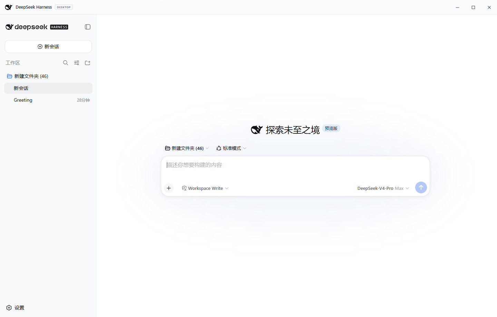

# DeepSeek Harness Desktop

[中文](README.md) · [Releases](https://github.com/cc1252/deepseek-harness-desktop/releases)

An open-source, unofficial Windows Electron wrapper for
[DeepSeek Harness](https://github.com/deepseek-ai/deepseek-harness).

The desktop process starts the official `@deepseek-ai/dsh` local web server and
loads its unmodified UI in a sandboxed Electron `WebContentsView`. The wrapper
only owns process lifecycle, native-window integration, navigation policy, and
the custom title bar.

> [!IMPORTANT]
> This is not an official DeepSeek product. It does not provide model credits
> or bypass API authentication. DeepSeek Harness is currently a Developer
> Preview; do not open untrusted projects with elevated permissions.



## Downloads

[GitHub Releases](https://github.com/cc1252/deepseek-harness-desktop/releases)
contains the complete NSIS installer, a portable executable, SHA-256 checksums,
an explicit source snapshot, and GitHub-generated source archives. Community builds are not commercially
code-signed, so Windows may display an unknown-publisher warning.
The installer uses the standard per-user application directory to avoid legacy
Windows path-length limits. Use the portable build when a custom location is
required.

## Pinned components

| Component | Version |
| --- | --- |
| `@deepseek-ai/dsh` | `0.1.0-rc.6` |
| Electron | `43.4.0` |
| Bundled Node.js | `24.19.0` |
| electron-builder | `26.15.3` |

## Run from source

Requirements: Windows 10/11 x64, Node.js 24, npm, and PowerShell 5 or newer.

```powershell
git clone https://github.com/cc1252/deepseek-harness-desktop.git
cd deepseek-harness-desktop
npm ci
npm run setup
npm run start
```

`npm run setup` installs the pinned Harness dependency tree, downloads the
official Node.js Windows runtime, verifies it against the official
`SHASUMS256.txt` and a repository-pinned checksum, extracts the upstream icon,
and generates bundled dependency license notices.

## Build Windows releases

```powershell
npm ci
npm run build:windows
```

The `dist/` directory will contain the NSIS installer, portable executable,
unpacked build, and `SHA256SUMS.txt`.

## Security model

- The Harness service listens on a random `127.0.0.1` port.
- The upstream UI uses `sandbox: true`, `contextIsolation: true`, and
  `nodeIntegration: false`.
- The title bar receives only a narrow minimize/maximize/close IPC bridge.
- Non-local navigation is delegated to the operating system browser.
- Closing the desktop app stops the child Harness process.

Application data and logs are stored below:

```text
%APPDATA%\deepseek-harness-desktop\harness-home
%APPDATA%\deepseek-harness-desktop\logs\desktop.log
```

## License and attribution

The wrapper is available under the [MIT License](LICENSE). DeepSeek Harness and
the whale icon belong to the upstream project and are used under its MIT
license. See [THIRD_PARTY_NOTICES.md](THIRD_PARTY_NOTICES.md) for details.
